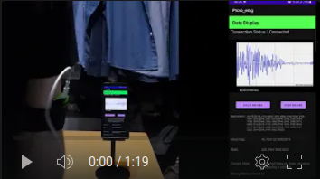
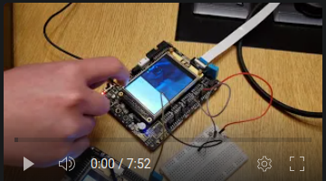

# Software Engineer

## Skills

| Skill                                         | Associated Project / Work         |
|-----------------------------------------------|----------------------------|
| Motor Controls      | <a href="https://semi.asmpt.com/zh-tw/products/ap/tcb/">Firebird TCB W2i+ @ ASMPT</a> |
| C++, Visual Studios, MFC, Win32, XML                 | Firebird TCB W2i+ @ ASMPT |
| UI/Human Machine Interface Development | Firebird TCB W2i+ @ ASMPT|
| Android Application Development, Java | <a href="https://github.com/kelvinwong020/FYP_EMG_Android">EMG Fitness Device</a>|
| Embedded System Development          | <a href="https://github.com/kelvinwong020/Smart-Home-System">Smart Home System</a>|
| C, I2C, UART, SPI, GPIO, STLink, STM32         | Smart Home System |
| Web Development (Python, Django, BootStrap) | LASARD Technology |
| OpenCV, Arduino, Raspberry Pi, Linux | LASARD Technology |

## Education		        		
B.Eng., Computer Engineering | The Hong Kong University of Science and Technology (_Aug 2022_)

## Work Experience
**Software Engineer @ ASMPT (_Aug 2022 - Oct 2023_)**
 Firebird W2i+ - Thermal Compression Bonding(TCB) | C++, XML, MFC, Win32, RS232, TCP/IP, Visual Studio
- Utilized MS Visual Studio to developed and debugged Human Machine Interface(HMI) and Microsoft 	Foundation Class (MFC) programs in C++ and XML on Windows 10 with a team of engineers.
- Increased machine accuracy by 100µm through new calibration method. Ensured 95 successful picks out of 100.
- Streamlined Graphical User Interface(GUI) and automated tasks. Improved productivity by 5%. 
- Utilized multi-threading, multi-processes, mutexes, and exceptions to handle data and motor motions.
- Processed digital signals from machine for analysis and debug, increasing machine stability and accuracy.
- Developed PowerShell scripts for testing new software features and patches.
- Utilized networking(TCP/IP) to integrate cameras and modules. Enabled customers to monitor production.
- Designed and participated in unit testings and debugged software. Customer achieved mass production.

One of the notable achievement during my employment is that I implemented 4 brand new modules for the latest model of the W2i+ machine, providing the customers a method that yields superior bonding results. I completed and tested the motor homing sequences, motion profile, designed the UI for the new modules, integrated the new mdodules into auto sequence, and so on. Through this project, I gained valuable insights on how to work with motors.
My daily duties included holding meetings with colleagues to update on progess and report technical difficulties, implementing new features according to specification, testing and validating updates, draft reports on code and UI changes, and more. 
I was appraised by superior as being fast-learning and a good team player in this role. 

**Firmware Engineer (Intern) @ LASARD Technology (Startup) (_Jan 2021 - Aug 2022_)**
 LASARD – Pest Control System | C, C++, Python, Arduino, Raspberry Pi, Linux, BASH, HTML, OpenCV, USB
- Developed image recognition system for use in pest control in restaurants. Product was granted seed funding.
- Improved image clarity by implementing camera auto-focus using C++, Python, and USB on Arduino
- Created Linux BASH Scripts for automating tasks
- Coded in Python and JavaScript to build company’s website using frameworks like Django and Bootstrap
- Wired and programmed microprocessors to control camera system for monitoring environment
- Conducted image processing with OpenCV to recognize potential bugs, achieved 80% true positives in testings.
- Debugged electronic hardware problems through oscilloscope and Digital Multimeters

Within this role, I completed the camera auto-focus feature thourgh controlling stepper motors using C++, USB serial communication and OpenCV; drafted the company's website with Python, Django, and JavaScript; created documentations and reports; participated meetings to update on progress and discuss further course of action; and integrated the system. The project was granted seed funding as a result.

## Projects (Detailed Project Portfolio May Be Found Within Repositories)
### EMG Fitness Device - HKUST Final Year Project
### [Android Application](https://github.com/kelvinwong020/FYP_EMG_Android) | [Arduino Code](https://github.com/whiteunicorn3404/JQ03a-21_EMG_FYP) | [YouTube Demo](https://youtu.be/pZxpOF_Pch0)

This project aims to build a portable and affordable personal muscle monitoring system, consisting of a wearable device containing EMG(Electromyography) sensors to track muscle signals and a mobile application (Android) to assist users in preventing muscle injuries during workouts or in daily life. The wearable device transmits real-time EMG data to the mobile application for signal analysis. When a drop in the median frequency in EMG is detected, the application will prompt the user to cease further activity to prevent injury. A TensorFlow model was included to classify the actions being taken by the user. The application was developed with Android Studios on Linux.

The technology used for this project are: <b>Java, Android, BLE, C++, Arduino, TensorFlow</b>.

### Smart Home System - HKUST ELEC 3300 Project
### [Repository](https://github.com/kelvinwong020/Smart-Home-System) | [YouTube Demo](https://youtu.be/idSp3R__D4U)

In this project, we built an IOT(Internet Of Things) system that utilizes STM32F103 (ARM-based controller) development boards to control an array of sensors and devices. This systems contains 4 major components: room monitoring, automatic brightness control, automatic temperature control, and control over WiFi. The project aims to provide a suite of centralized electronic devices that can improve the quality of life within a household. Originally, the system was intended to have a door lock control system and a mobile application for remote control. But due to budget and time constraints, these components was reduced to room monitoring and web server instead. 

The technology used for this project are: <b>C, I2C, UART, SPI, GPIO, STLink, STM32</b>.

